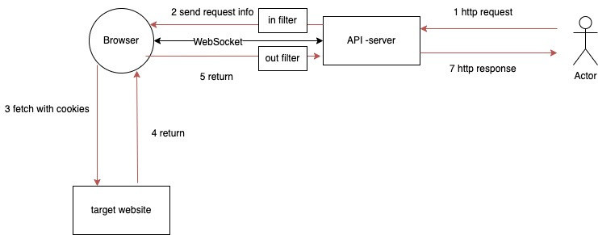
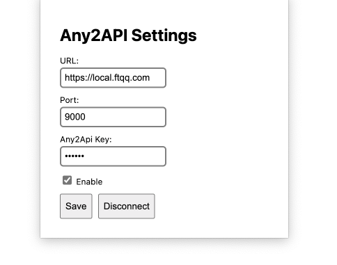

# any2api

A framework that turns any website into an API

[简体中文](./README_CN.md) | [English](./README.md)

> This project is mainly aimed at developers and only provides a brief explanation. If you have any questions, you can directly read the code, as the core code is only about 500 lines.



## Loading extension

Directory: extension

To load an unpacked extension in Chrome, follow these steps:

1. Open the Chrome browser and click on the menu button (three vertical dots) in the top right corner.
2. Select "More tools" > "Extensions".
3. In the top right corner of the Extensions page, enable "Developer mode".
4. Click on the "Load unpacked" button.
5. In the dialog box that appears, select the folder where the extension is located and click the "Select folder" button.
6. The extension will be loaded into Chrome.

To load an unpacked extension in Edge, follow these steps:

1. Open the Edge browser and click on the menu button (three horizontal dots) in the top right corner.
2. Select "Extensions".
3. In the bottom left corner of the Extensions page, enable "Developer mode".
4. Click on the "Load unpacked" button.
5. In the dialog box that appears, select the folder where the extension is located and click the "Select folder" button.
6. The extension will be loaded into Edge.


## Starting the Server

### Local Start

### Environment Variables

1. API_PASSWORD - The password used when making API requests, passed through the any2api-key header. Leave empty to disable authentication.
2. API_TIMEOUT - The timeout duration in seconds. Default is 30 seconds.

After installing the node environment, run `cd api && node app.js`.

### Docker-compose

Run `docker-compose up -d` in the root directory.

### Docker

```
docker build -t any2api . && docker run -p 9000:9000 -v $(pwd)/api/filter:/app/filter -v $(pwd)/api/ssl:/app/ssl any2api
```


## Connection Service



To start:

1. Select Enable
2. Click Save Connection

To reconnect:

1. Click Disconnect
2. Select Enable
3. Click Save Connection

## API Requests

1. `/send` - Send a standard HTTP request.
    1. url: Passed through query, needs to be URL-encoded.
    1. any2api-key: Passed through header, specified during startup through the environment variable API_PASSWORD.
    1. Other method, headers, and body will be forwarded as is.
    1. The response headers returned are from the browser plugin.

1. `/stream` - Send SSE (Server-Sent Events) request.
    1. url: Passed through query, needs to be URL-encoded.
    1. any2api-key: Passed through header, specified during startup through the environment variable API_PASSWORD.
    1. Other method, headers, and body will be forwarded as is.
    1. The response headers returned are forcibly replaced with:
    ```
    res.writeHead(200, {
        'Content-Type': 'text/event-stream;charset=utf-8',
        'Cache-Control': 'no-cache',
        'Connection': 'keep-alive'
    });
    ```

1. `/:domain/v1/chat/completions` - Alias for `/stream`, used for compatibility with certain OpenAI clients.

## Custom Services

### SSL Certificate

Place under `api/ssl`:

1. api/ssl/ssl.cert - Certificate file.
1. api/ssl/ssl.key - Private key file.

### Data Filter

1. Create a directory under `api/filter` based on the request domain.
1. The directory supports three types of files:
    1. in.js - Filter for the data received on the server before being sent to the browser plugin.
    1. out.js - Filter for the data returned by the browser plugin to the server before being sent back.
    1. chunk.js - Filter for the data returned by the browser plugin to the server in Server-Sent Events mode, for each returned chunk.

The format for writing the filters is as follows:

```
module.exports = function filter(data) {
    return {...data, headers:{...data.headers, "ai-api":"very-good" }};
}
```

The `data` in the in filter includes:

```
let payload = {
        url: url,
        headers: headers,
        body: body,
        method: req.method
    };
```

The `data` in the out filter includes:

```
let payload = {
    headers: ret.headers,
    body: ret.any2api
}
```

The `data` in the chunk filter includes:

```
let chunkInfo = JSON.parse(chunk);
```

## Thanks to

- [eventsource-parser](https://github.com/rexxars/eventsource-parser)