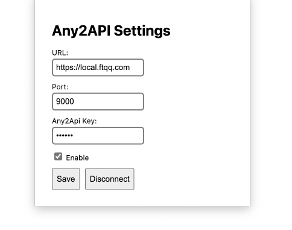

# any2api


> 本项目主要面向开发者，只提供简要的说明。如果有疑问，可直接阅读代码，核心代码只有500行左右。

[简体中文](./README_CN.md) | [English](./README.md)


## TLDR

1. 是什么：一个将网站转为API的框架和工具
1. 为什么：做自动化的时候需要模拟请求，Cookie和IP是两大难点，any2api都能解决
1. 能做什么：
    1. 将本地HTTP服务转为公网可以访问的API接口（比如你在家里Mac上跑着模型，想通过网站提供收费服务） 
    1. 爬虫、对网页进行内容监测，通过filter生成RSS或者其他特定格式 
    1. 格式转换器，通过filter转换接口，比如将Claude API转为OpenAI格式
1. 不能做什么：依赖于浏览器，不适合用于提供高并发高压力的服务


## 加载插件

插件目录 extension 

在Chrome中加载未打包的扩展程序，可以按照以下步骤进行操作：

1. 打开Chrome浏览器，点击右上角的菜单按钮（三个竖点）。
2. 选择“更多工具”>“扩展程序”。
3. 在扩展程序页面的右上角，打开“开发者模式”。
4. 点击“加载已解压的扩展程序”按钮。
5. 在弹出的对话框中，选择扩展程序所在的文件夹，并点击“选择文件夹”按钮。
6. 扩展程序将被加载到Chrome浏览器中。

在Edge中加载未打包的扩展程序，可以按照以下步骤进行操作：

1. 打开Edge浏览器，点击右上角的菜单按钮（三个水平点）。
2. 选择“扩展”。
3. 在扩展页面的左下角，打开“开发者模式”。
4. 点击“加载已解压的扩展”按钮。
5. 在弹出的对话框中，选择扩展程序所在的文件夹，并点击“选择文件夹”按钮。
6. 扩展程序将被加载到Edge浏览器中。


## 启动服务端

### 环境变量

1. API_PASSWORD - 请求API时的密码，通过 header中的 any2api-key 传递，留空时不校验。
1. API_TIMEOUT - 超时时间，单位为秒，默认30秒。

### 本地启动

安装node环境后，cd api && node app.js 即可

### Docker-compose 

在根目录运行 `docker-compose up  -d `

### Docker

```
docker build -t any2api . && docker run -p 9000:9000 -v $(pwd)/api/filter:/app/filter -v $(pwd)/api/ssl:/app/ssl any2api
```
## 连接服务



启动：

1. 选中 Enable
1. 点击 Save 连接

重新连接：

1. 点击 Disconnect
1. 选中 Enable
1. 点击 Save 连接

## 请求api

1. `/send` - 发送http标准请求。
    1. url : 通过 query 传入，需要 urlencode 编码
    1. any2api-key: 通过 header 传入，启动时通过环境变量 API_PASSWORD 指定
    1. 其他的 method、headers和body都将原样转发
    1. 返回的 response headers 为浏览器插件返回的

1. `/stream` - 发送SSE请求，
    1. url : 通过 query 传入，需要 urlencode 编码
    1. any2api-key: 通过 header 传入，启动时通过环境变量 API_PASSWORD 指定
    1. 其他的 method、headers和body都将原样转发
    1. 返回的 response headers 强制替换为 
    ```
    res.writeHead(200, {
        'Content-Type': 'text/event-stream;charset=utf-8',
        'Cache-Control': 'no-cache',
        'Connection': 'keep-alive'
    });
    ```

1. `/:domain/v1/chat/completions` - `/stream` 的别名，用于兼容某些 openai 客户端


## 定制服务

### SSL证书

`api/ssl` 下放入

1. api/ssl/ssl.cert 证书文件
1. api/ssl/ssl.key 私钥文件

### 数据filter

1. api/filter 下，按请求域名建立目录
1. 目录下支持三种文件
    1. in.js 服务器端接收到的数据，在往浏览器插件前的过滤器
    1. out.js 浏览器插件返回给服务器端的数据，在最后返回前的过滤器
    1. chunk.js 浏览器插件返回给服务器端的数据，Server Send Event模式下，对每一个返回的 chunk 的过滤器

编写格式为 

```
module.exports = function filter( data )
{
    return {...data, headers:{...data.headers, "ai-api":"very-good" }};
}
```

in filter的 data 包括 

```
let payload = {
        url: url,
        headers: headers,
        body: body,
        method: req.method
    };
```

out filter 的 data 包括

```
let payload = {
    headers: ret.headers,
    body: ret.any2api
}
```

chunk filter 的 data 包括

```
let chunkInfo = JSON.parse(chunk);
```

## 感谢

- [eventsource-parser](https://github.com/rexxars/eventsource-parser)